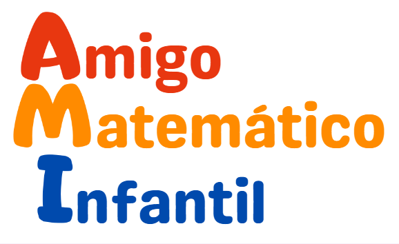

    

# Projeto final  5 - Módulo Testes Automatizados
____
Este é o repositório do nosso projeto desenvolvido para a disciplina de Projeto Integrador: Unidade Front-end do curso de Análise e Desenvolvimento de Sistemas da Faculdade Senac - Pernambuco. A proposta é dar continuação ao projeto desenvolvendo os modelos relacional e entidade-relacionamento como requisito avaliativo da disciplina de Banco de Dados do mesmo curso e instituição.

### Integrantes do grupo - Squad 2:

    👨‍💻 Everton Sebastião do Nascimento 
    👨‍💻  Igor Vinicius da Silva Nascimento
    👨‍💻   
    👨‍💻 
    👨‍💻 
